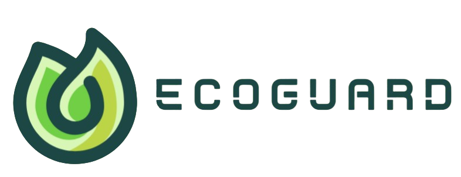

# EcoGuard : Environmental Protection and Reporting Platform

## Bangkit Capstone Project 2024 Batch 2

Bangkit Capstone Team ID : C242 - PR629  
Here is our repository for Bangkit Capstone project. 

## Our Team

|              Name              | Bangkit-ID   |   Learning Path    |                                                                    
| :----------------------------: | :--------:   | :----------------: | 
| Wurianty Sarah                 | M001B4KX4511 |  Machine Learning  |            
| Mikha El Charisto Rahardjo     | M409B4KY2499 |  Machine Learning  |              
| Ghulwan Shihabuddin            | C119B4KY1619 |  Cloud Computing   |            
| Diamond Panca Lady             | C189B4KX1107 |  Cloud Computing   |    
| Revina Aurigha Firdaus         | C284B4KX3767 |  Cloud Computing   | 
| Putri Yuliana Alisia           | C295B4KX3526 |  Cloud Computing   |  

## About this project
# 

---

## **Executive Summary/Abstract**
In recent years, environmental issues such as air pollution, poor waste management, and industrial waste have increasingly degraded the quality of life and public health. Despite the urgency of these issues, existing reporting mechanisms often lack efficiency, accessibility, and actionable guidance. **EcoGuard** addresses these gaps by providing a user-friendly platform that empowers individuals to report environmental concerns directly through interactive maps. The platform visualizes these reports in real-time, enabling both users and authorities to identify critical hotspots quickly.

---

## Cloud Implementation
|       Service      | Framework    |  Tools             |                                                                    
| :----------------- | :----------: | :----------------: | 
| Front End          | React JS     |  App Engine        | 
| Back End           | Express JS   |  App Engine        | 

